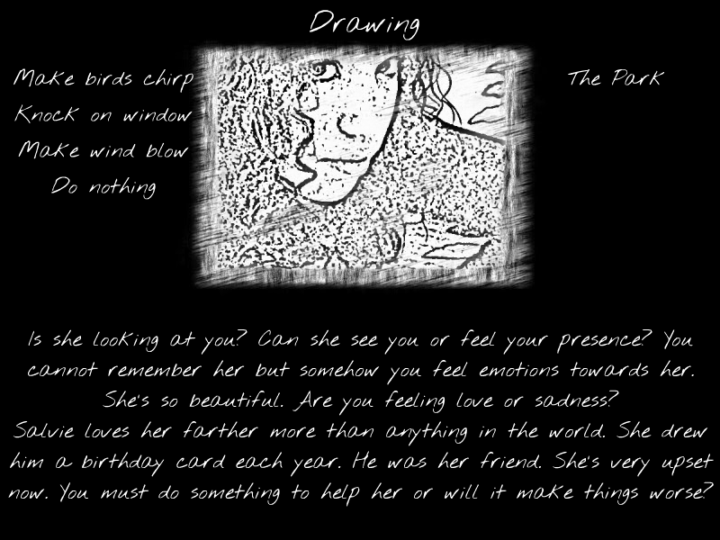

Salvie
======

_A psychotic supernatural thriller_
------------------------------------

A game created in 72 hours for LD33.

Theme: You are the Monster.

Who are you? Why are you here? And what happened? 

Turn off the lights, put on your headphones, and enjoy this supernatural thriller as it unfolds. The game is an interactive story where your choices reveal different parts and perspectives of an engaging and profound mystery. 

Make selections from the available choices to the left and right of the ghostly vision by clicking them. 

For this Jam game, we used creepy music from Incompetech and a font from Google. Everything else was created by me and my daughter. 

The main tools were iPhone 6 (for videos), After Effects, Photoshop, Flash Professional, and Flash Develop. 

[Salvie Entry](http://ludumdare.com/compo/ludum-dare-33/?action=preview&uid=35091)

[Salvie Game](http://www.twistedwords.net/ld33/Salvie.swf)
